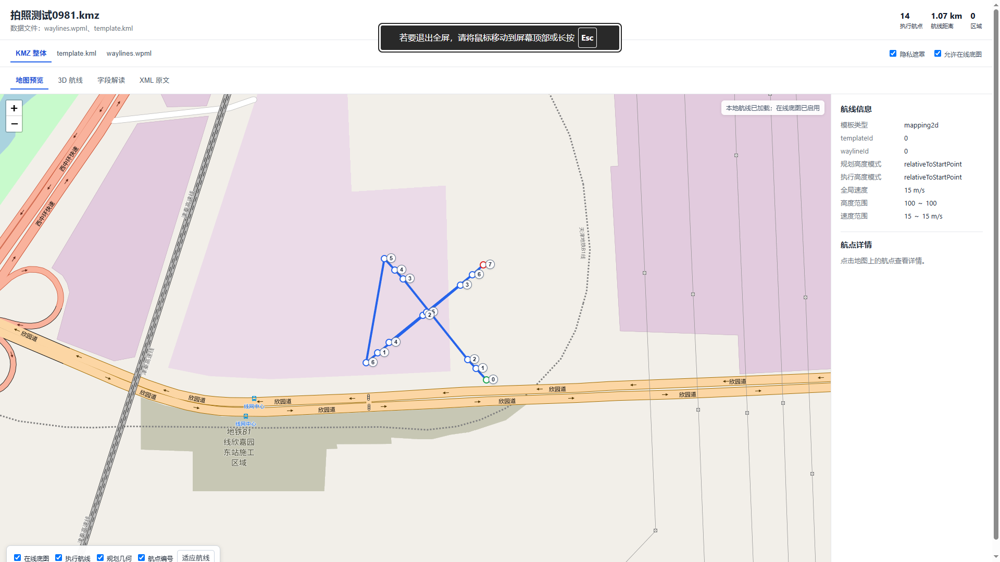
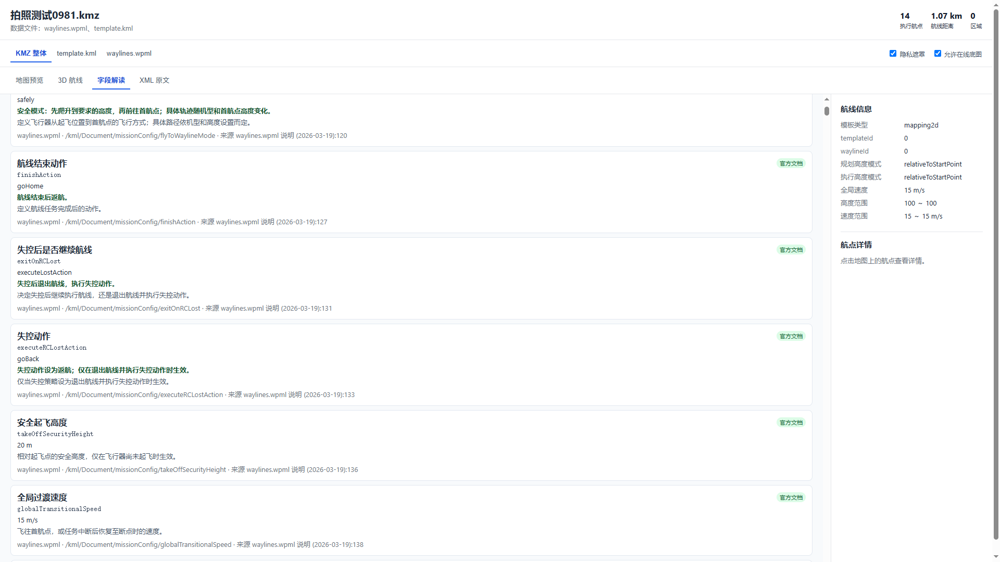
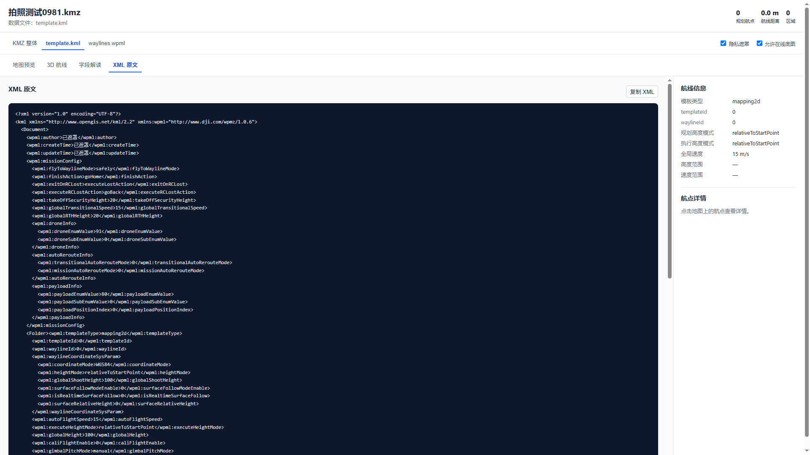

# KMZ Preview

[下载最新版 Windows 安装包](https://github.com/wsadexq/KMZ-reader/releases/latest/download/install.exe) · [查看所有版本](https://github.com/wsadexq/KMZ-reader/releases)

KMZ Preview 是一个 Windows 本地工具，用于快速查看 DJI KMZ 航线。它直接读取 KMZ 内的 `wpmz/waylines.wpml` 和 `wpmz/template.kml`，在浏览器中提供 2D 地图、无 Token 的本地 3D 航线、字段解读和 XML 原文查看方式。

## 界面预览

### 2D 航线地图



### WPML 字段解读



### XML 原文



## 特点

- KMZ 直接作为 ZIP 读取，不需要改后缀或整体解压。
- 在线地图默认开启；地图不可用时自动隐藏瓦片并保留本地航线预览。
- 3D 航线使用随程序内置的 CesiumJS 和简略地球影像，不请求在线地形或地图 Token；放大到航点级别时，影像不包含街道等细节。
- 不上传 KMZ 文件，解析和预览数据只在本机处理。
- 支持双击/右键打开，也支持文件选择窗口。
- 安装包自带运行环境，用户不需要安装 Python。

## 环境

- Windows 10 或更高版本
- 普通用户：从 GitHub Releases 下载 `install.exe`，无需下载源码或安装 Python。
- 开发者本地构建后的安装包位于 `release\install.exe`。

## 安装

双击下载的 `install.exe`，选择安装位置。安装器只写入当前用户，不需要管理员权限。

安装完成后，右键 `.kmz` 文件，选择“Preview KMZ with KMZ Preview”，即可预览，不依赖当前默认打开程序。Windows 11 上可能需要先点“显示更多选项”。

安装器会在当前用户范围注册 KMZ Preview，并尝试将 `.kmz` 的双击默认程序设为 KMZ Preview。如果 Windows 已保存你手动选择的默认应用，系统可能继续使用原程序；此时在“打开方式”中选择 KMZ Preview，并勾选“始终使用”即可。

安装后会在安装目录生成 `uninstall.exe`，开始菜单也会创建卸载快捷方式；Windows“应用和功能”中也会登记 KMZ Preview 的卸载入口。

## 开发者命令行

```powershell
python kmz_preview.py "D:\routes\example.kmz"
```

不带路径时会打开文件选择窗口：

```powershell
python kmz_preview.py
```

## 解析范围

程序将 `waylines.wpml` 作为执行航线，将 `template.kml` 作为规划数据。规划高度和执行高度会分别显示，不会自行转换高度基准。未知扩展字段会保留为提示，不会宣称 KMZ 能被设备执行。

预览结果只用于查看航线，不能代替 DJI Pilot、司空或实际飞行前检查，也不代表飞行安全或设备兼容性。

## 文件查看和字段来源

顶部可以在 `KMZ 整体`、`template.kml` 与 `waylines.wpml` 之间切换。`KMZ 整体`显示合并后的执行航线和规划几何；单文件视图分别查看对应内容。“XML 原文”保留原始文本。“字段解读”以 2026-03-19 的 DJI 上云 API 三份 WPML 页面文本为准，收录全部 267 条 WPML 字段表记录（172 个不同字段名），按所属文件显示中文名、类型、单位、当前值、路径和来源；部分枚举还显示当前取值的含义。该快照未描述的扩展字段仍标记“未收录”，不推断含义。`scripts/build_field_catalog.py` 可使用重新复制的三份官方页面文本生成字段目录，也支持从官方 GitHub 仓库 Markdown 生成较旧的目录。

## 地图和隐私

航线 XML 在本地解析。浏览器默认向地图瓦片服务请求当前查看区域；原始 KMZ 文件不会上传。在线底图失败时会自动隐藏瓦片并保留本地航线。3D 视图使用文件中的椭球高度（没有时使用原始高度），不启用在线地形，因此相对起飞点或海拔高度不会在本地被擅自换算。隐私遮罩默认开启，会遮住 XML 和字段表中的作者、坐标、时间等值，地图仍按本地数据绘制航线。

项目包含 Leaflet 1.9.4 的本地浏览器文件，许可信息见 `THIRD_PARTY_NOTICES.md`。

## 卸载

可运行安装目录中的 `uninstall.exe`，使用开始菜单的卸载快捷方式，或从 Windows“应用和功能”卸载。卸载器会先检查专用安装标记，再清理本程序创建的右键菜单、卸载登记、菜单项和程序文件。只有 `.kmz` 仍关联到 KMZ Preview 时，才恢复安装前记录的文件类型关联；安装后若已改为其他程序，卸载不会覆盖新的选择。
